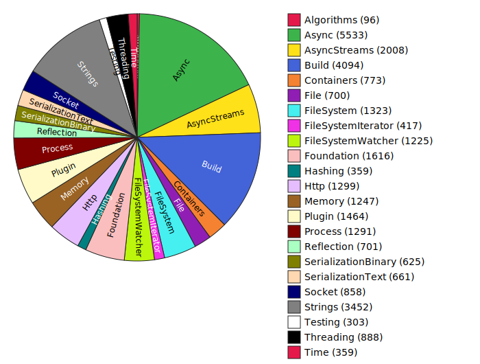

@page page_dependencies Dependencies
This file describes what each library depends on. It also lists the number of lines of code (LOC) for each library, both including and excluding comments.

# [Algorithms](@ref library_algorithms)
- Direct dependencies: [Foundation](@ref library_foundation)
- All dependencies: [Foundation](@ref library_foundation)
- Lines of code (excluding comments): 96
- Lines of code (including comments): 161

# [Async](@ref library_async)
- Direct dependencies: [File](@ref library_file), [FileSystem](@ref library_file_system), [Foundation](@ref library_foundation), [Socket](@ref library_socket), [Threading](@ref library_threading), [Time](@ref library_time)
- All dependencies: [File](@ref library_file), [FileSystem](@ref library_file_system), [Foundation](@ref library_foundation), [Socket](@ref library_socket), [Threading](@ref library_threading), [Time](@ref library_time)
- Lines of code (excluding comments): 5533
- Lines of code (including comments): 7336

# [AsyncStreams](@ref library_async_streams)
- Direct dependencies: [Async](@ref library_async), [Foundation](@ref library_foundation)
- All dependencies: [Async](@ref library_async), [File](@ref library_file), [FileSystem](@ref library_file_system), [Foundation](@ref library_foundation), [Socket](@ref library_socket), [Threading](@ref library_threading), [Time](@ref library_time)
- Lines of code (excluding comments): 2008
- Lines of code (including comments): 2551

# [Build](@ref library_build)
- Direct dependencies: [Algorithms](@ref library_algorithms), [Containers](@ref library_containers), [FileSystem](@ref library_file_system), [FileSystemIterator](@ref library_file_system_iterator), [Foundation](@ref library_foundation), [Hashing](@ref library_hashing), [Process](@ref library_process), [Strings](@ref library_strings)
- All dependencies: [Algorithms](@ref library_algorithms), [Containers](@ref library_containers), [File](@ref library_file), [FileSystem](@ref library_file_system), [FileSystemIterator](@ref library_file_system_iterator), [Foundation](@ref library_foundation), [Hashing](@ref library_hashing), [Memory](@ref library_memory), [Process](@ref library_process), [Strings](@ref library_strings), [Time](@ref library_time)
- Lines of code (excluding comments): 4094
- Lines of code (including comments): 4751

# [Containers](@ref library_containers)
- Direct dependencies: [Algorithms](@ref library_algorithms), [Foundation](@ref library_foundation), [Memory](@ref library_memory)
- All dependencies: [Algorithms](@ref library_algorithms), [Foundation](@ref library_foundation), [Memory](@ref library_memory)
- Lines of code (excluding comments): 773
- Lines of code (including comments): 1061

# [File](@ref library_file)
- Direct dependencies: [Foundation](@ref library_foundation)
- All dependencies: [Foundation](@ref library_foundation)
- Lines of code (excluding comments): 700
- Lines of code (including comments): 925

# [FileSystem](@ref library_file_system)
- Direct dependencies: [File](@ref library_file), [Foundation](@ref library_foundation), [Time](@ref library_time)
- All dependencies: [File](@ref library_file), [Foundation](@ref library_foundation), [Time](@ref library_time)
- Lines of code (excluding comments): 1323
- Lines of code (including comments): 1752

# [FileSystemIterator](@ref library_file_system_iterator)
- Direct dependencies: [Foundation](@ref library_foundation)
- All dependencies: [Foundation](@ref library_foundation)
- Lines of code (excluding comments): 417
- Lines of code (including comments): 541

# [FileSystemWatcher](@ref library_file_system_watcher)
- Direct dependencies: [Async](@ref library_async), [Foundation](@ref library_foundation), [Threading](@ref library_threading)
- All dependencies: [Async](@ref library_async), [File](@ref library_file), [FileSystem](@ref library_file_system), [Foundation](@ref library_foundation), [Socket](@ref library_socket), [Threading](@ref library_threading), [Time](@ref library_time)
- Lines of code (excluding comments): 1225
- Lines of code (including comments): 1557

# [Foundation](@ref library_foundation)
- Direct dependencies: *(none)*
- All dependencies: *(none)*
- Lines of code (excluding comments): 1616
- Lines of code (including comments): 2414

# [Hashing](@ref library_hashing)
- Direct dependencies: [Foundation](@ref library_foundation)
- All dependencies: [Foundation](@ref library_foundation)
- Lines of code (excluding comments): 359
- Lines of code (including comments): 490

# [Http](@ref library_http)
- Direct dependencies: [Async](@ref library_async), [Containers](@ref library_containers), [FileSystem](@ref library_file_system), [Foundation](@ref library_foundation), [Memory](@ref library_memory), [Socket](@ref library_socket), [Strings](@ref library_strings)
- All dependencies: [Algorithms](@ref library_algorithms), [Async](@ref library_async), [Containers](@ref library_containers), [File](@ref library_file), [FileSystem](@ref library_file_system), [Foundation](@ref library_foundation), [Memory](@ref library_memory), [Socket](@ref library_socket), [Strings](@ref library_strings), [Threading](@ref library_threading), [Time](@ref library_time)
- Lines of code (excluding comments): 1299
- Lines of code (including comments): 1639

# [Memory](@ref library_memory)
- Direct dependencies: [Foundation](@ref library_foundation)
- All dependencies: [Foundation](@ref library_foundation)
- Lines of code (excluding comments): 1247
- Lines of code (including comments): 1664

# [Plugin](@ref library_plugin)
- Direct dependencies: [Algorithms](@ref library_algorithms), [Containers](@ref library_containers), [FileSystem](@ref library_file_system), [FileSystemIterator](@ref library_file_system_iterator), [Foundation](@ref library_foundation), [Memory](@ref library_memory), [Process](@ref library_process), [Strings](@ref library_strings), [Threading](@ref library_threading), [Time](@ref library_time)
- All dependencies: [Algorithms](@ref library_algorithms), [Containers](@ref library_containers), [File](@ref library_file), [FileSystem](@ref library_file_system), [FileSystemIterator](@ref library_file_system_iterator), [Foundation](@ref library_foundation), [Memory](@ref library_memory), [Process](@ref library_process), [Strings](@ref library_strings), [Threading](@ref library_threading), [Time](@ref library_time)
- Lines of code (excluding comments): 1464
- Lines of code (including comments): 1844

# [Process](@ref library_process)
- Direct dependencies: [File](@ref library_file), [Foundation](@ref library_foundation)
- All dependencies: [File](@ref library_file), [Foundation](@ref library_foundation)
- Lines of code (excluding comments): 1291
- Lines of code (including comments): 1789

# [Reflection](@ref library_reflection)
- Direct dependencies: [Algorithms](@ref library_algorithms), [Containers](@ref library_containers), [Foundation](@ref library_foundation), [Memory](@ref library_memory), [Strings](@ref library_strings)
- All dependencies: [Algorithms](@ref library_algorithms), [Containers](@ref library_containers), [Foundation](@ref library_foundation), [Memory](@ref library_memory), [Strings](@ref library_strings)
- Lines of code (excluding comments): 701
- Lines of code (including comments): 995

# [SerializationBinary](@ref library_serialization_binary)
- Direct dependencies: [Foundation](@ref library_foundation), [Memory](@ref library_memory), [Reflection](@ref library_reflection)
- All dependencies: [Algorithms](@ref library_algorithms), [Containers](@ref library_containers), [Foundation](@ref library_foundation), [Memory](@ref library_memory), [Reflection](@ref library_reflection), [Strings](@ref library_strings)
- Lines of code (excluding comments): 625
- Lines of code (including comments): 860

# [SerializationText](@ref library_serialization_text)
- Direct dependencies: [Foundation](@ref library_foundation), [Reflection](@ref library_reflection), [Strings](@ref library_strings)
- All dependencies: [Algorithms](@ref library_algorithms), [Containers](@ref library_containers), [Foundation](@ref library_foundation), [Memory](@ref library_memory), [Reflection](@ref library_reflection), [Strings](@ref library_strings)
- Lines of code (excluding comments): 661
- Lines of code (including comments): 853

# [Socket](@ref library_socket)
- Direct dependencies: [Foundation](@ref library_foundation), [Threading](@ref library_threading), [Time](@ref library_time)
- All dependencies: [Foundation](@ref library_foundation), [Threading](@ref library_threading), [Time](@ref library_time)
- Lines of code (excluding comments): 858
- Lines of code (including comments): 1147

# [Strings](@ref library_strings)
- Direct dependencies: [Foundation](@ref library_foundation), [Memory](@ref library_memory)
- All dependencies: [Foundation](@ref library_foundation), [Memory](@ref library_memory)
- Lines of code (excluding comments): 3452
- Lines of code (including comments): 4963

# [Testing](@ref library_testing)
- Direct dependencies: [Foundation](@ref library_foundation), [Memory](@ref library_memory), [Strings](@ref library_strings)
- All dependencies: [Foundation](@ref library_foundation), [Memory](@ref library_memory), [Strings](@ref library_strings)
- Lines of code (excluding comments): 303
- Lines of code (including comments): 381

# [Threading](@ref library_threading)
- Direct dependencies: [Foundation](@ref library_foundation)
- All dependencies: [Foundation](@ref library_foundation)
- Lines of code (excluding comments): 888
- Lines of code (including comments): 1166

# [Time](@ref library_time)
- Direct dependencies: [Foundation](@ref library_foundation)
- All dependencies: [Foundation](@ref library_foundation)
- Lines of code (excluding comments): 359
- Lines of code (including comments): 524

---
# Project Total
- Total lines of code (excluding comments): 31292
- Total lines of code (including comments): 41364

